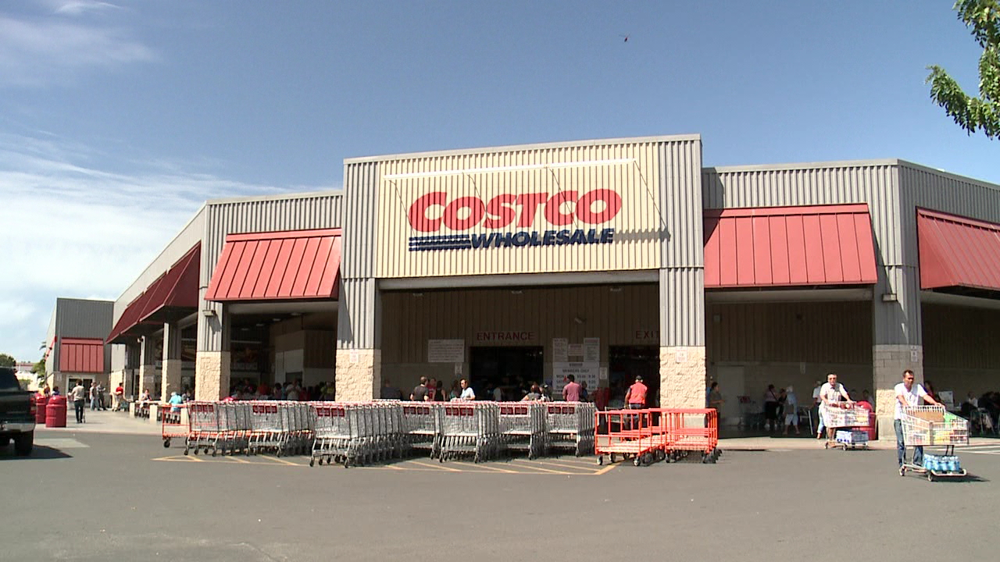
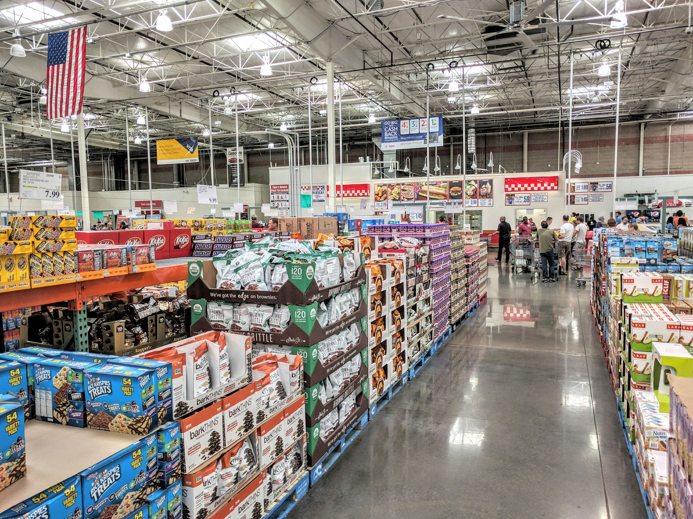

I have been working at Costco for a little over a year now and it has taught me many valueable skills. As a student and working 30 hours a week, it can be tough maintaining school assignments and work obligations. This job has trained me to manage my time wisely to accomplish all the tasks expected of me. Also, I have experience working with others as a team while trying to accomplish one shared goal of providing the best service possible. There are many different personalities at Costco and working together can be challenging at times, but it is a great skill to be able to put differences aside and come together as a company. 

Working alongside coworkers is not as big as a challenge as providing service for members shopping. Sometimes, members are not nice, but it is very important to stay even headed and treat them with no biases and respect. Patience and communication are great skills I learned from Costco. Talking to coworkers to get tasks done efficiently and talking to members to relay information and answering questions is practice for working in teams for programming jobs or assignments. Being able to stay calm when others are frantic and being able to keep focused when there is a lot going on around you are valuable skills I gained from being a Costco employee.

