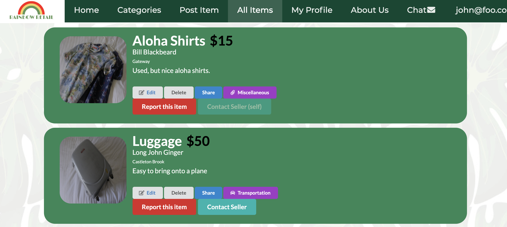

Our goal was to create a platform that UH students could use to safely buy and sell goods and appliances. Users are able to view and browse through posted items and contact sellers if they are interested in purchasing goods. There are user profiles to keep track of who posted what and to display who and where is this item posted from. Inappropriate postings can be reported by other users and site administration have the ability to remove any post. There were five members to our group and much of the work was divided. Communication was an essential part of this project and due to the Covid-19 pandemic this was made more difficult. We were not able to meet in person so communication was mainly through text and over Discord. Not working face to face was a challenge, but our team overcame the complication and managed to come together to create an application for university students.

