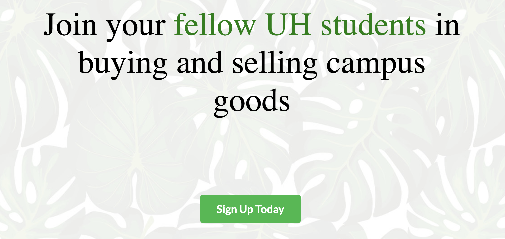

- [View Documentation](https://github.com/renigmaflea/renigmaflea)

Our goal was to create a platform that UH students could use to safely buy and sell goods and appliances. Users are able to view and browse through posted items and contact sellers if they are interested in purchasing goods. There are user profiles to keep track of who posted what and to display who and where is this item posted from. Inappropriate postings can be reported by other users and site administration have the ability to remove any post. There were five members to our group and much of the work was divided. Communication was an essential part of this project and due to the Covid-19 pandemic this was made more difficult. We were not able to meet in person so communication was mainly through text and over Discord. Not working face to face was a challenge, but our team overcame the complication and managed to come together to create an application for university students.

For the project I created the about us page, some of the profile and item pages, a lot of overall styling, and buttons with web functions. I was not much involved with the database aspect and storing and saving user information. Most of the contributions to the application were front end based and some back end adjustments were made by me. However, this project gave me confidence in being able to create an organized professional website. Communication skills and managing tasks among others were greatly developed. Working together, voicing opinions and concerns was just as important to the programming aspect of the project. 

This experience has taught me how to work in groups to achieve a common goal. Communication and scheduling is key to having a successful group of programmers. Since we were working together, constant talking was needed to organize and divide tasks. I feel I am a lot more experienced as a programmer and working with others. 

